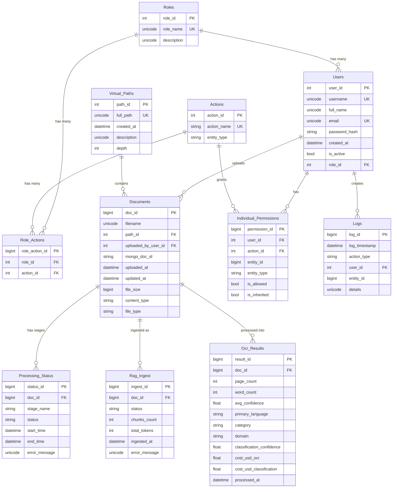
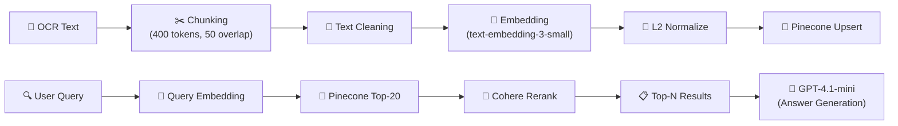
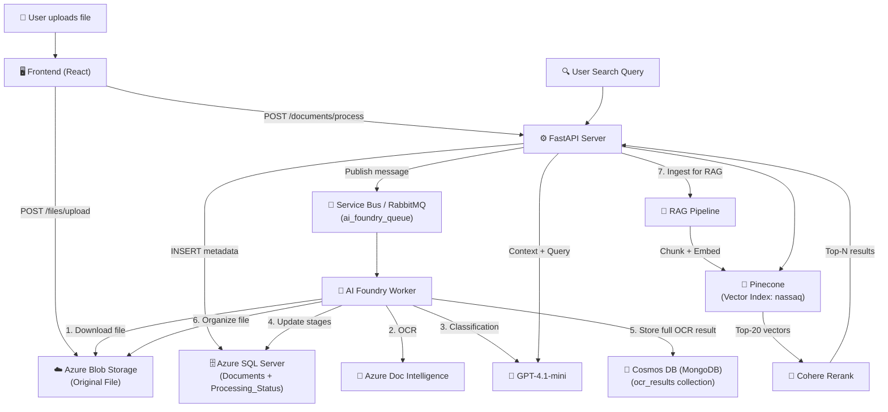

# 📊 تقرير شامل: أنواع الـ Data Storage في مشروع نسّاق (Nassaq)

> [!IMPORTANT]
> المشروع بيستخدم **5 أنظمة تخزين مختلفة** + **نظام Message Broker** للربط بينهم. كل نظام ليه دور محدد ومبني على نوع الداتا اللي بيخزنها.

---

## 🏛️ نظرة عامة: ليه أكتر من نوع Storage؟

مشروع نسّاق هو نظام **Document Intelligence** بيعمل OCR + AI Classification + Semantic Search (RAG) للوثائق القانونية. كل نوع داتا ليه طبيعة مختلفة، عشان كده بنستخدم أنسب storage لكل نوع:

| نوع الداتا | المتطلبات | الـ Storage المناسب |
|---|---|---|
| بيانات منظمة (Users, Permissions) | ACID, Foreign Keys, Complex Queries | **SQL Server** |
| نتائج OCR كاملة (نصوص كبيرة متغيرة) | Schema-less, Large Documents | **Cosmos DB (MongoDB)** |
| ملفات أصلية (PDF, صور) | Binary Large Objects | **Azure Blob Storage** |
| Embeddings للبحث الدلالي | Vector Similarity Search (ANN) | **Pinecone** |
| رسائل معالجة async | Reliable Message Delivery | **Azure Service Bus** |

---

## 1️⃣ Azure SQL Server (Relational Database) — قاعدة البيانات الأساسية

### الوصف
الـ **Relational Database** الرئيسية للمشروع. بتخزن كل الـ structured data اللي محتاجة ACID transactions و foreign key constraints.

### التقنيات المستخدمة
| Component | Technology |
|---|---|
| Database Engine | **Microsoft SQL Server** (Azure SQL) |
| ORM | **SQLAlchemy 2.0+** (Async) |
| Driver | **aioodbc** + **pyodbc** + ODBC Driver 18 |
| Connection | Async via `create_async_engine` |

### Connection String Pattern
```
mssql+aioodbc://{user}:{pass}@{server}/{db}?driver=ODBC+Driver+18+for+SQL+Server&TrustServerCertificate=yes
```

### Configuration
- **Server:** `sdmsdb.database.windows.net`
- **Database:** `SDMS_DB`
- **Pool Settings:** `pool_pre_ping=True`, `pool_recycle=1800`, `timeout=30`

### الـ ERD — كل الجداول والعلاقات (11 Table)



### ليه SQL Server؟
- **ACID Transactions**: عمليات الـ Users والـ Permissions محتاجة consistency
- **Foreign Keys**: العلاقات بين الجداول لازم تكون enforced (مثلاً: مينفعش doc يتربط بـ user مش موجود)
- **Complex Queries**: الـ filtering بالـ status + stage_name + pagination
- **RBAC**: نظام الصلاحيات المعقد (Role-Based + Individual Permissions)
- **Audit Trail**: جدول Logs للتتبع

### ملفات الكود المرتبطة
- Models: [models.py](file:///home/waly/nassaq/server/app/models/models.py)
- Session: [session.py](file:///home/waly/nassaq/server/app/db/session.py)
- Operations: [ops.py](file:///home/waly/nassaq/server/app/db/ops.py)
- Config: [config.py](file:///home/waly/nassaq/server/app/core/config.py)
- Migrations: [migrations/](file:///home/waly/nassaq/server/migrations)

---

## 2️⃣ Azure Cosmos DB (MongoDB API) — تخزين نتائج OCR الكاملة

### الوصف
**NoSQL Document Database** بيخزن نتائج الـ OCR الكاملة كـ JSON documents. بيستخدم **MongoDB API** عبر Azure Cosmos DB.

### التقنيات المستخدمة
| Component | Technology |
|---|---|
| Database | **Azure Cosmos DB** (MongoDB vCore cluster) |
| Driver | **Motor** (Async MongoDB driver for Python) |
| Auth | SCRAM-SHA-256 + SSL |
| Collection | `ocr_results` |

### Connection String Pattern
```
mongodb://{user}:{pass}@{host}:10260/?ssl=true&authMechanism=SCRAM-SHA-256&retrywrites=false
```

### Configuration
- **Host:** `fc-e0a1ae3e45b9-000.mongocluster.cosmos.azure.com`
- **Database:** `sdmsdb`
- **Collection:** `ocr_results`
- **Port:** `10260`
- **Index:** `doc_id` (unique)

### الـ Document Schema

```json
{
    "doc_id": 123,
    "filename": "contract_v2.pdf",
    "file_type": "pdf",
    "blob_path": "law/contracts/contract_v2.pdf",
    "extracted_text": "النص الكامل المستخرج بالـ OCR (ممكن يكون آلاف الأسطر)...",
    "ocr": {
        "page_count": 15,
        "word_count": 4500,
        "avg_confidence": 0.94,
        "primary_language": "ar",
        "cost_usd": 0.30,
        "elapsed_seconds": 12.5,
        "chunks_used": 3
    },
    "classification": {
        "domain": "Law",
        "category": "Contracts",
        "confidence": 0.97,
        "reasoning": "يحتوي على بنود تعاقدية وشروط قانونية...",
        "tokens_used": 850,
        "cost_usd": 0.0015,
        "error": null
    },
    "processed_at": "2026-06-14T19:30:00Z"
}
```

### العمليات
| Operation | الوصف |
|---|---|
| `find_one({"doc_id": id})` | جلب نتيجة OCR كاملة |
| `replace_one(filter, doc, upsert=True)` | إدراج أو تحديث (idempotent) |
| `delete_one({"doc_id": id})` | حذف عند حذف المستند |

### الربط مع SQL Server
- جدول `Documents` في SQL فيه عمود `mongo_doc_id` (String 36) بيخزن الـ `_id` بتاع الـ document في Cosmos DB
- ده بيسمح بالربط بين الـ relational metadata والـ full OCR output

### ليه Cosmos DB (MongoDB) مش SQL؟
- **Schema-less**: كل مستند ليه شكل مختلف (عدد صفحات، جداول، لغات)
- **Large Documents**: النص المستخرج ممكن يكون آلاف الأسطر — مش عملي يتخزن في SQL column
- **Nested Objects**: الـ `ocr` و `classification` objects بتتخزن naturally كـ nested JSON
- **Flexible Queries**: سهل تعمل query على أي field بدون schema migration
- **Global Distribution**: Cosmos DB بيدعم geo-replication عشان الـ latency

### ملفات الكود المرتبطة
- Server Cosmos Client: [cosmos.py](file:///home/waly/nassaq/server/app/db/cosmos.py)
- AI Foundry Cosmos Client: [cosmos.py](file:///home/waly/nassaq/ai-foundry/app/db/cosmos.py) (الـ full-featured client)

---

## 3️⃣ Azure Blob Storage — تخزين الملفات الأصلية

### الوصف
**Object Storage** لتخزين الملفات الأصلية (PDF, صور, Word docs) كـ Binary Large Objects.

### التقنيات المستخدمة
| Component | Technology |
|---|---|
| Service | **Azure Blob Storage** |
| SDK | **azure-storage-blob** (Sync + Async) |
| Auth | **SAS Token** (Shared Access Signature) |
| Container | `demo` |

### Connection Pattern
```
https://{account}.blob.core.windows.net/{container}?sp=racwdl&st=...&se=...&sig=...
```

### Configuration
- **Account:** `nassaqq.blob.core.windows.net`
- **Container:** `demo`
- **Max Upload:** 50 MB

### خدمتين مختلفتين

#### 1. File Storage Service (Sync) — للرفع والتحميل المباشر
```
Blob Name = document_id (UUID)
Metadata  = original_filename + content_type
```

| Operation | الوصف |
|---|---|
| `upload(doc_id, bytes, filename, type)` | رفع ملف أصلي |
| `download(doc_id)` | تحميل ملف (bytes + type + filename) |
| `delete(doc_id)` | حذف ملف |
| `exists(doc_id)` | التحقق من وجود ملف |

#### 2. Azure Blob Storage (Async) — لمعالجة الـ AI Pipeline
```
Blob Path = {domain}/{category}/{filename}
مثال: law/contracts/contract_v2.pdf
```

| Operation | الوصف |
|---|---|
| `upload(data, path)` → URL | رفع بعد التصنيف في folder منظم |
| `download(path)` → bytes | تحميل للمعالجة بالـ OCR |
| `delete(path)` | حذف الملف القديم بعد نقله |
| `find(query, prefix)` | بحث في الـ blobs |
| `list(path)` / `delete_dir(path)` | إدارة الـ virtual folders |

### الـ File Organization Pipeline
```
1. User يرفع ملف → يتخزن كـ UUID blob
2. AI Worker يحمل الملف → يعمل OCR + Classification
3. الملف يترفع تاني في: {domain}/{category}/{filename}
   مثال: law/contracts/contract_v2.pdf
4. الملف الأصلي (UUID) يفضل موجود للـ "View Original"
```

### ليه Blob Storage؟
- **Binary Data**: الملفات الأصلية (PDF, DOCX, JPG) هي binary files — مش هينفع تتخزن في SQL أو MongoDB بكفاءة
- **Scalability**: Azure Blob بيتحمل petabytes من الداتا
- **Cost Effective**: أرخص بكتير من database storage للملفات الكبيرة
- **CDN Integration**: ممكن يتكامل مع CDN للتوزيع
- **SAS Tokens**: أمان على مستوى الـ container بدون exposing credentials

### ملفات الكود المرتبطة
- Sync Client: [file_storage.py](file:///home/waly/nassaq/server/app/services/file_storage.py)
- Async Client: [storage.py](file:///home/waly/nassaq/server/app/core/storage.py)

---

## 4️⃣ Pinecone — Vector Database (للـ RAG Pipeline)

### الوصف
**Serverless Vector Database** لتخزين الـ document embeddings واستخدامها في الـ Semantic Search (RAG).

### التقنيات المستخدمة
| Component | Technology |
|---|---|
| Service | **Pinecone** (Serverless) |
| SDK | **pinecone** Python SDK v6+ |
| Embedding Model | **Azure OpenAI text-embedding-3-small** (1536 dimensions) |
| Similarity Metric | **Cosine Similarity** |
| Cloud | AWS us-east-1 |

### Configuration
- **Index Name:** `nassaq`
- **Dimensions:** 1536
- **Metric:** cosine
- **Spec:** Serverless (AWS / us-east-1)
- **Batch Size:** 100 vectors per upsert

### الـ Vector Schema (Metadata per Vector)

| Field | Type | Filterable | الوصف |
|---|---|---|---|
| `document_id` | string | ✅ | UUID المستند |
| `chunk_index` | int | ✅ | رقم الـ chunk |
| `page_number` | int | ❌ | رقم الصفحة |
| `token_count` | int | ❌ | عدد tokens |
| `section_heading` | string | ❌ | عنوان القسم |
| `text_clean` | string | ❌ | النص المنظف |
| `text_original` | string | ❌ | النص الأصلي |
| `classification` | string | ✅ | تصنيف المستند |
| `domain` | string | ✅ | المجال |
| `language` | string | ✅ | اللغة |
| `source_file` | string | ❌ | اسم الملف |
| `created_at` | string | ❌ | تاريخ الإنشاء |

### الـ RAG Pipeline



### العمليات
| Operation | الوصف |
|---|---|
| `add(vectors, metadatas, doc_id)` | رفع vectors لمستند (batched upserts) |
| `search(query_vector, k=20)` | بحث بالـ cosine similarity |
| `remove_document(doc_id)` | حذف كل vectors لمستند |
| `has_document(doc_id)` | التحقق من وجود مستند |
| `list_documents()` | قائمة كل المستندات |
| `total_vectors` / `total_documents` | إحصائيات |

### ليه Pinecone؟
- **Vector Search**: محتاجين Approximate Nearest Neighbor (ANN) search — SQL و MongoDB مش مصممين لكده
- **Serverless**: مفيش infrastructure management — بيعمل auto-scale
- **Low Latency**: البحث بياخد milliseconds حتى مع ملايين vectors
- **Metadata Filtering**: ممكن تفلتر بالـ domain, classification, language قبل الـ similarity search
- **Two-Stage Retrieval**: Pinecone recall + Cohere rerank = دقة أعلى 15-30%

### ملفات الكود المرتبطة
- Vector Store: [vector_store.py](file:///home/waly/nassaq/server/app/services/rag/vector_store.py)
- RAG Engine: [engine.py](file:///home/waly/nassaq/server/app/services/rag/engine.py)
- Embedding Client: [embedding_client.py](file:///home/waly/nassaq/server/app/services/rag/embedding_client.py)
- Text Processor: [text_processor.py](file:///home/waly/nassaq/server/app/services/rag/text_processor.py)
- Reranker: [reranker.py](file:///home/waly/nassaq/server/app/services/rag/reranker.py)

---

## 5️⃣ Azure Service Bus / RabbitMQ — Message Broker

### الوصف
**Message Queue System** لإرسال مهام المعالجة بشكل async بين الـ Server والـ AI Worker.

### التقنيات المستخدمة (Dual-Mode)

| Environment | Broker | Library |
|---|---|---|
| 🏭 Production | **Azure Service Bus** | `azure-servicebus` |
| 💻 Development | **RabbitMQ** | `aio-pika` (AMQP) |

### الـ Queues
| Queue Name | الوظيفة |
|---|---|
| `ocr_queue` | مهام الـ OCR |
| `ai_foundry_queue` | مهام الـ AI Foundry (OCR + Classification + Organization) |

### رسالة المعالجة (Message Schema)
```json
{
    "doc_id": 42,
    "file_path": "contract_v2.pdf",
    "filename": "contract_v2.pdf"
}
```

### السلوك
- **Prefetch Count = 1**: معالجة رسالة واحدة في كل مرة
- **Durable Queue**: الرسائل مش هتضيع لو الـ worker وقع
- **Error Handling**: لو حصل error → الرسالة بترجع الـ queue (requeue/abandon)
- **Success**: بعد النجاح → `complete_message`

### ليه Message Broker؟
- **Async Processing**: الـ OCR + Classification بياخدوا دقائق — مش ممكن يكون synchronous
- **Decoupling**: السيرفر والـ AI Worker منفصلين تماماً
- **Reliability**: الرسائل durable — مش هتضيع لو حصل crash
- **Scalability**: ممكن تزود workers من غير ما تغير الـ server

### ملفات الكود المرتبطة
- Server Broker: [broker.py](file:///home/waly/nassaq/server/app/core/broker.py)
- AI Foundry Broker: [broker.py](file:///home/waly/nassaq/ai-foundry/app/core/broker.py)

---

## 6️⃣ Client-Side Storage (localStorage)

### الوصف
الـ Frontend بيستخدم **localStorage فقط** لتخزين بيانات بسيطة client-side.

| Key | المحتوى | الغرض |
|---|---|---|
| `__nassaq_tokens` | `{ accessToken, refreshToken }` | JWT Authentication |
| `language` | `"en"` أو `"ar"` | تفضيل اللغة |
| `theme` | `"light"` أو `"dark"` | تفضيل الثيم |

> [!NOTE]
> مفيش IndexedDB أو sessionStorage أو أي client-side database. كل الداتا الفعلية بتيجي من الـ Backend عبر REST API.

---

## 🔄 الـ Data Flow الكامل — من الرفع للبحث



---

## 📊 جدول مقارنة شامل لكل الـ Storage Types

| | SQL Server | Cosmos DB | Blob Storage | Pinecone | Service Bus |
|---|---|---|---|---|---|
| **النوع** | Relational DB | Document DB (NoSQL) | Object Storage | Vector DB | Message Queue |
| **Azure Service** | Azure SQL | Cosmos DB (MongoDB API) | Azure Blob | Pinecone (3rd party) | Azure Service Bus |
| **البيانات** | Structured (tables) | Semi-structured (JSON) | Unstructured (files) | Vectors + metadata | Messages (JSON) |
| **الاستخدام** | Users, Permissions, Metadata, Logs | Full OCR results, Classification details | Original files (PDF, images) | Document embeddings for search | Async job processing |
| **Query Language** | SQL (via SQLAlchemy) | MongoDB Query | REST API | Vector similarity | Queue operations |
| **الحجم** | صغير-متوسط (KBs per row) | متوسط-كبير (KBs-MBs per doc) | كبير (MBs per file, up to 50MB) | صغير (1536 floats per vector) | صغير (bytes per message) |
| **الـ Consistency** | Strong (ACID) | Eventual / Session | Strong | Eventual | At-least-once |
| **Driver** | aioodbc + SQLAlchemy | Motor (async) | azure-storage-blob | pinecone SDK | azure-servicebus / aio-pika |

---

## 📦 الـ Dependencies المرتبطة بكل Storage

| Package | Version | الـ Storage |
|---|---|---|
| `sqlalchemy` | ≥2.0.45 | SQL Server |
| `aioodbc` | ≥0.5.0 | SQL Server (async ODBC) |
| `pyodbc` | ≥5.3.0 | SQL Server (ODBC driver) |
| `motor` | ≥3.0.0 | Cosmos DB (async MongoDB) |
| `azure-storage-blob` | ≥12.20.0 | Blob Storage |
| `pinecone` | ≥6.0.0 | Pinecone Vector Store |
| `azure-servicebus` | ≥7.14.3 | Azure Service Bus |
| `aio-pika` | ≥9.6.2 | RabbitMQ (development) |
| `numpy` | ≥1.26.0 | Vector operations (L2 normalization) |

---

## ⚠️ ملاحظات إضافية

> [!TIP]
> **خدمات AI (مش storage بس بتتعامل مع الداتا):**
> - **Azure Document Intelligence** — OCR service (prebuilt-layout model, Arabic support)
> - **Azure OpenAI (gpt-4.1-mini)** — Document classification + RAG answer generation
> - **Azure OpenAI (text-embedding-3-small)** — Text embeddings (1536 dims)
> - **Cohere Rerank v4.0-fast** — Search results reranking

> [!NOTE]
> **Credentials موجودة في `.env` بس مش مستخدمة في الكود:**
> - Cohere Rerank — الـ endpoint و key موجودين بس الكود في مكانه ومستخدم
> - JWT settings — مشتركة بين الـ server والـ ai-foundry

> [!WARNING]
> الـ `.env` files فيها actual secrets (passwords, API keys, SAS tokens). لازم يتشالوا قبل أي commit عام ويتحطوا في Azure Key Vault أو environment variables.
